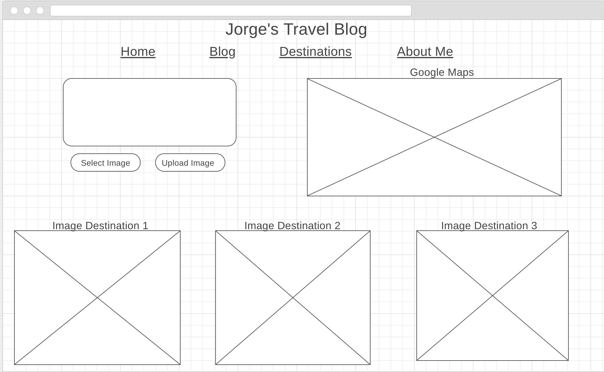

# Project 3 Travel Blog

## Description

This application is a personal travel blog in which a "nomad" will be able to post/share their experiences of different destinations they've visited. They can dish out advice, stories, recommendations, or reviews on all of these destinations visited.

## Platform
Application will have a home page with title of blog. Below title will be a navigaton with the following: Home, Blog, Destinations, About Me.
The body on Home page will display a picture of one of destinations the user has visited. Home page will also have a link for O-Auth Google Sign In. The Blog page is where the user will be able to make posts based on their experiences. The Destinations page will image uploader to display pictures of all destinations the user has visited. Destinations page will also have a Google Map where pins will indicate all places that have been visited. About Me page will have background and contact information for the blogger.

## User Stories for Minimum Viable Product

- As a user I want to be able to sign-in onto my own account using Google.

- As a user I want to be able Create, Read, Update, and Delete a post.

- As a user I want to be able to upload pictures to render on to the Destinations page.

- As a user I want to be able to drop pins on a Google Map of all places I've visited.

## Wireframes

## Trello

[Trello](https://trello.com/b/wl9H2k0u/travel-blog-project-3)
